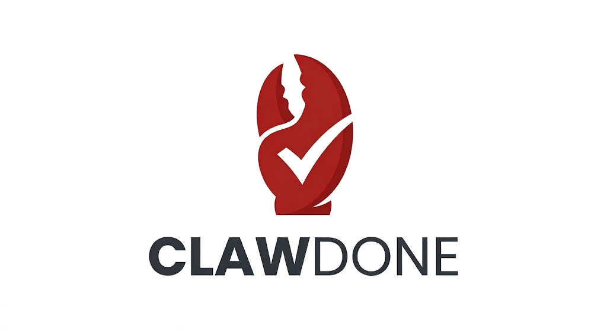

# ClawDone



[English](README.md)

ClawDone 是一个面向手机端的远程 coding agent 控制台。

它通过 SSH 连接远程 Linux 服务器上的 `tmux` pane，让用户可以在手机浏览器中查看 session、发送命令、中断任务、读取最近输出，并对任务状态做轻量管理，而不需要打开完整的桌面环境。

## 项目用途

ClawDone 的核心链路如下：

```text
Mobile Browser
  -> ClawDone Web UI
  -> ClawDone service
  -> SSH
  -> remote tmux pane
  -> coding agent
```

它主要面向以下使用方式：

- 开发者在远程服务器上运行 Codex 或其他 coding agent
- agent 长时间驻留在 `tmux` 中
- 用户希望在不打开电脑的情况下，用手机继续调度工作
- 用户需要比原始移动端 SSH 更清晰的控制界面

## 当前能力

### 远程目标管理

- 保存多个 SSH Target
- 使用分组、标签、收藏、备注组织目标
- 为每个目标保存超时、重试、host key policy 等 SSH 配置
- 在 Dashboard 中汇总多个目标的状态

### 远程 tmux 控制

- 列出远程 `tmux` 的 session、window、pane
- 将 pane 作为 agent 控制对象
- 为 pane 绑定本地 alias，例如 `backend-agent`
- 向 pane 发送命令
- 向 pane 发送 `Ctrl+C`
- 读取 pane 最近输出

### 面向手机的交互能力

- 内置移动端 Web UI
- 命令模板与历史命令
- 浏览器本地语音转文字
- 更快地在目标与 pane 间切换

### 任务与交付基础能力

- 为指定 target 和 pane 创建 todo
- 跟踪任务状态，例如 `todo`、`in_progress`、`blocked`、`done`、`verified`
- 为任务附加证据，例如输出片段或摘要
- 智能清理较旧的已完成任务，并默认保留最近完成项
- 记录审计日志和任务事件
- 支持 planner / executor / reviewer 形式的 workflow triplet

### 安全与访问控制

- Web 服务支持 Bearer Token
- 支持 `admin`、`operator`、`viewer` 角色映射
- 危险命令可配置 `allow`、`confirm`、`deny` 三种策略
- SSH host key policy 支持 `strict`、`accept-new`、`insecure`
- 支持通过 share token 提供只读 session 分享

## 安装

ClawDone 需要 Python `3.11+`。

```bash
python3 -m venv .venv
. .venv/bin/activate
python -m pip install -e .
```

安装后会自动带上 `paramiko`，用于服务端发起 SSH 连接。

## 快速开始

启动 Web 服务：

```bash
python -m clawdone serve \
  --host 0.0.0.0 \
  --port 8787 \
  --token your-secret
```

然后在手机浏览器打开：

```text
http://<服务器IP>:8787
```

如果你的内网环境屏蔽了 `8787`，可以改用例如 `8000`：

```bash
python -m clawdone serve --host 0.0.0.0 --port 8000 --token your-secret
```

更适合实际部署的示例：

```bash
python -m clawdone serve \
  --host 0.0.0.0 \
  --port 8787 \
  --token your-secret \
  --store-path ~/.clawdone/profiles.json \
  --host-key-policy strict \
  --ssh-timeout 10 \
  --ssh-command-timeout 15 \
  --ssh-retries 1 \
  --ssh-retry-backoff-ms 300 \
  --dashboard-workers 8 \
  --risk-policy confirm
```

## 微信桥接

仓库现在自带了一个微信桥接子项目：[wechat-bridge](wechat-bridge/README.md)。

它基于官方 iLink 通道版的 `wechat-ai`，可以做到：

- 终端扫码登录微信
- 接收受信微信用户的消息
- 用和网页端相同的 `ClawDone API` 权限去调用后端
- 把 pane 输出和执行结果回发到微信

最短启动方式：

```bash
cd wechat-bridge
cp config.example.json config.json
npm install
npm start -- --config ./config.json
```

完整说明、第一次接入流程、discovery 模式、微信命令列表和常见问题见 [wechat-bridge/README.md](wechat-bridge/README.md)。

## 基本使用流程

### 1. 新建 SSH Target

在 Web UI 中填写以下信息：

- 名称
- 主机和端口
- 用户名
- 密码或 SSH key 路径
- `tmux` 可执行文件路径
- 分组、标签、描述、收藏标记
- 可选的 SSH 覆盖参数

### 2. 查看远程 tmux 状态

保存 target 后，ClawDone 可以读取：

- session
- window
- pane

示例 pane 标识：

- `codex:0.0`
- `codex:1.0`
- `research:2.1`

### 3. 给 pane 绑定 agent 别名

例如：

- `backend-agent`
- `frontend-agent`
- `release-bot`

### 4. 发送命令或中断任务

ClawDone 通过 `tmux send-keys` 向远程 pane 发送命令，例如：

```bash
tmux send-keys -t codex:0.0 -l 'run tests and summarize failures'
tmux send-keys -t codex:0.0 Enter
```

也支持发送 `Ctrl+C` 和读取最近输出。

### 5. 跟踪任务

用户可以为指定 target 和 pane 创建 todo，更新状态，附加证据，并在后续通过移动端界面或 API 查看执行结果。

TODO 页面还支持更安全的已完成任务清理：默认只清理较旧的 `done` / `verified` 项，并保留最近 `5` 条已完成任务，避免刚做完就被误删。

## CLI

除了 Web 服务，ClawDone 也保留了面向本地 tmux 的 CLI，便于调试和脚本调用。

列出本地 tmux session：

```bash
python -m clawdone list-sessions
```

向本地 tmux session 发送命令：

```bash
python -m clawdone send --session codex --command "run tests"
```

向本地 tmux session 发送中断：

```bash
python -m clawdone interrupt --session codex
```

读取本地 tmux session 最近输出：

```bash
python -m clawdone capture --session codex --lines 120
```

## 安全建议

- 实际部署时优先使用 `--host-key-policy strict`
- 如果服务暴露给本机以外的访问方，建议启用 `--token` 或 `--rbac-tokens-json`
- SSH 凭据和 profile store 应保存在受保护的位置
- 若 agent 可能接收危险命令，建议使用 `--risk-policy confirm` 或 `deny`

## 项目结构

- `clawdone/html.py` — 内置移动端 Web UI
- `clawdone/web.py` — HTTP 路由与请求处理
- `clawdone/store.py` — profile、alias、template、todo、audit 数据存储
- `clawdone/remote.py` — SSH 执行与远程 tmux 检查
- `clawdone/local_tmux.py` — 本地 tmux 辅助客户端
- `clawdone/cli.py` — CLI 入口
- `tests/test_app.py` — 存储、Web API、tmux 行为相关测试

## 开发

运行测试：

```bash
python -m unittest tests.test_app
```

## 项目说明

- `TODO.md` 用来记录当前路线图和未完成事项。
- `DONE.md` 用来记录已经完成的能力和最近交付内容。

## GitHub Pages

仓库已经新增 `docs/` 静态站点，以及自动部署工作流 `.github/workflows/deploy-pages.yml`。

这个仓库更推荐直接用 `docs/` 目录发布：

1. 先把 `docs/` 目录提交并推送到 `main` 或 `master`。
2. 打开 GitHub 仓库的 **Settings → Pages**。
3. 将 **Source** 设置为 **Deploy from a branch**。
4. 选择分支 `main`，目录选择 `/docs`。
5. 保存后等待 GitHub Pages 发布。

也可以使用 GitHub Actions：

- 将 **Source** 设置为 **GitHub Actions**。
- 然后推送到 `main` 或 `master`，或者手动运行 `deploy-pages` 工作流。

按当前仓库地址，项目页面通常会发布到：

```text
https://thuasta.github.io/ClawDone/
```

注意这是 **project site**，不是用户主页。因此直接打开 `https://thuasta.github.io/` 仍然可能是 404，这属于正常现象；应访问带仓库名路径的地址。

## Roadmap

项目后续路线见 `TODO.md`，已完成能力见 `DONE.md`。
